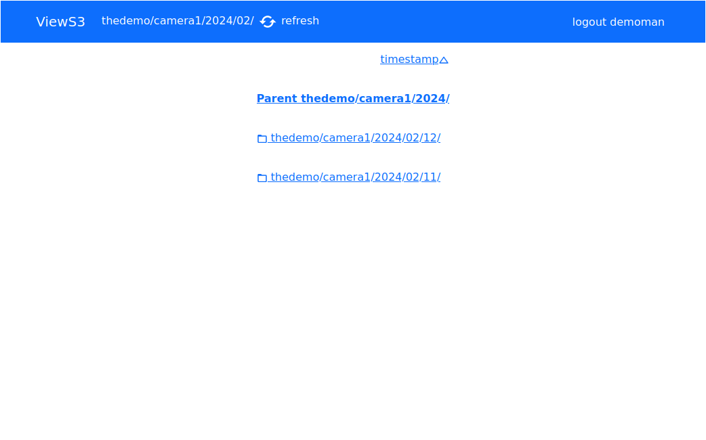
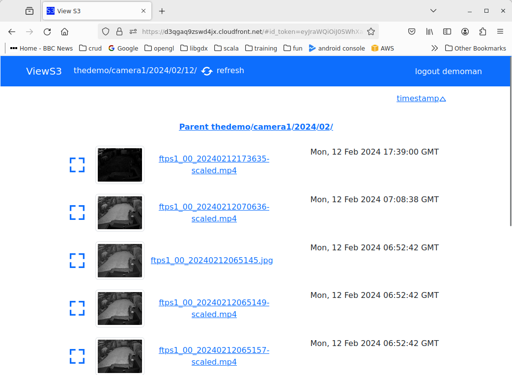
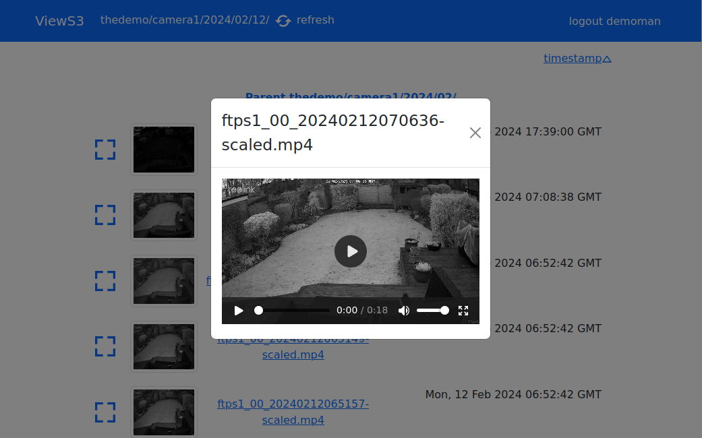
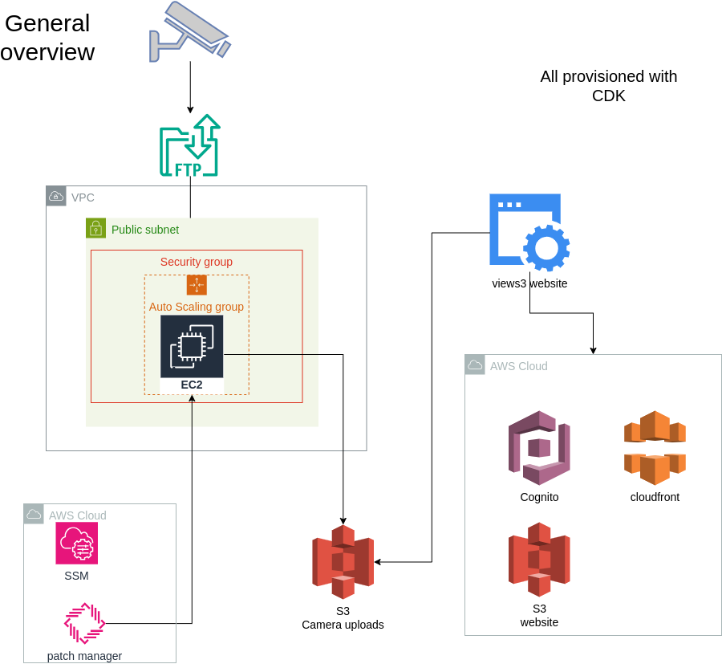
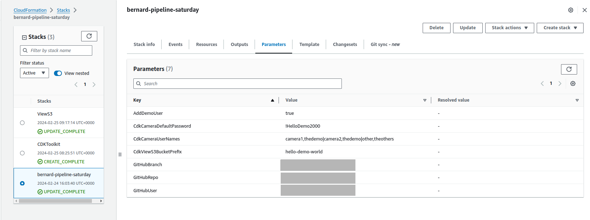
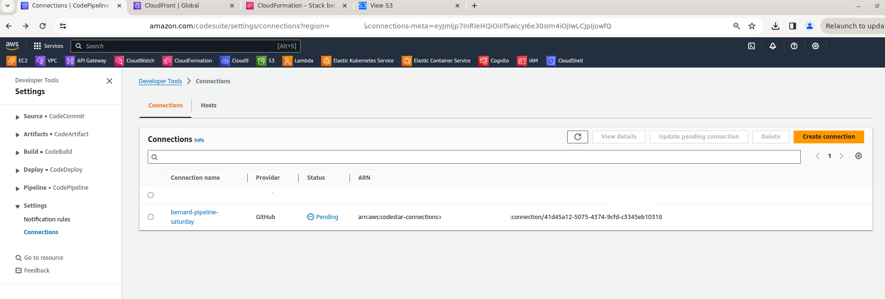
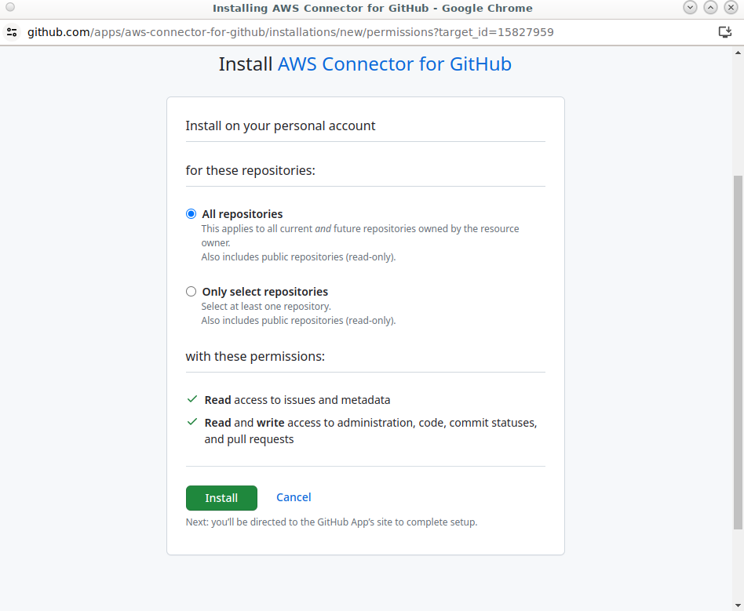
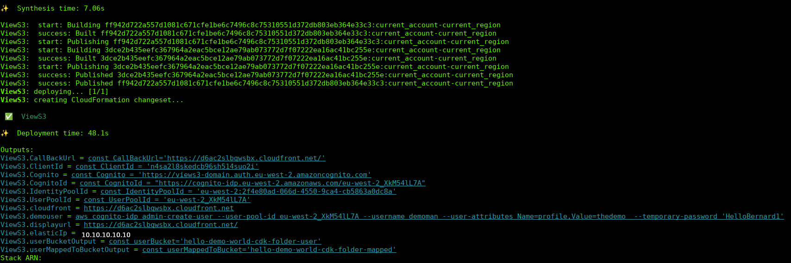

# ViewS3

This project allows multiple security cameras and groups of users to log onto a website to display the videos captured by their security cameras.

  


An AWS stack is deployed that:
- creates a dedicated VPC    
- creates a single EC2 in the VPC that provides a location for cameras to ftp upload video/jpg to.     
- patches EC2 automatically.     
- uses Cognito for authentication of users    
- Cloudfront/S3 for a React website to view video/jpgs captured.     
- EC2 uses IPV4




## using pipeline
***You need to take a fork of the code as the pipeline will be triggered by your github repository***

From the aws console eu-west-2 as admin create a cloudformation stack using

[pipeline.yaml](pipeline.yaml)

You will need to have forked this github project as the pipeline will need to setup a connection to access the code

|cdk parameter|description|
| -------- | ------- |
|CdkCameraDefaultPassword|is the initial password for each of the ftp users created. You will need to log onto the EC2 instance using SSM Session Manager as SSH port 22 is not enabled.|  
|CdkCameraUserNames|is a list of camera ftp usernames and the group they are in. &lt;username>,&lt;group>&#124;<br>e.g. camera1,grp1&#124;camera2,grp1&#124;other,grp2| 
|CdkViewS3BucketPrefix|This has to be a unique name as S3 buckets have this as a prefix.|
|GitHubBranch|main by default|
|GitHubRepo|path in github repo, mine is bernardjason/views3|
|GitHubUser|your guthub username/email|




you will need to confirm the pending codestar connection to github




github will prompt



## to deploy at command line

### prerequistes
node --version
v20.9.0
npm --version
10.1.0


To deploy the system create a file in cdk directory called 

views3.properties

The file must contain these values
```
userName=camera1,thedemo|camera2,thedemo|other,theothers
userPassword=!HelloDemo2000
bucketPrefix=<!!! make sure I am unique!!!>
```

where userName is a list of camera ftp usernames and the group they are in. 

userPassword is the initial password for each of the ftp users created. You 
will need to log onto the EC2 instance using SSM Session Manager as SSH port 22 is not enabled.

bucketPrefix. This has to be a unique name as S3 buckets have this as a prefix. 

```
mkdir client/build
cd cdk
cdk bootstrap
npm install
npm run cdk-deploy
npm run parse-client
npm run cognito-css
```

We now have to redeploy the React website as we have the details of Cloudfront/Cognito 
```
cd ../client
npm install
npm run build
cd ../cdk
npm run cdk-deploy
```

CDK output gives the front end URL and ip address cameras should upload to




Front end users are not added by CDK, nor can users sign add themselves. They must be provisioned with a script that creates the users with an initial password.
They also get a profile set, this is used to map the user to a group. Cameras and users are in a group.

```
node createUser.js  demoman thedemo HelloBernard1
```

or the CDK does output command needed for aws cli
ViewS3.demouser = .....


```
aws cognito-idp admin-create-user --user-pool-id <pool id>--username demoman --user-attributes Name=profile,Value=thedemo  --temporary-password 'HelloBernard1'
```


