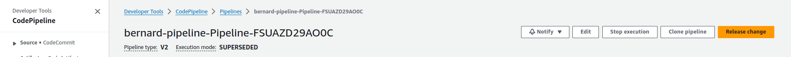
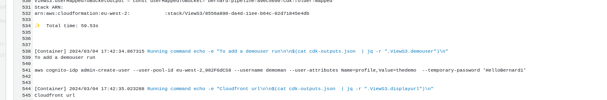
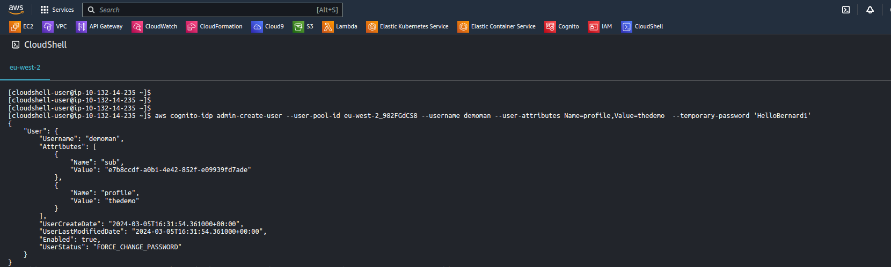
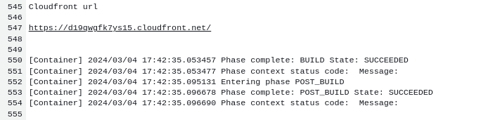
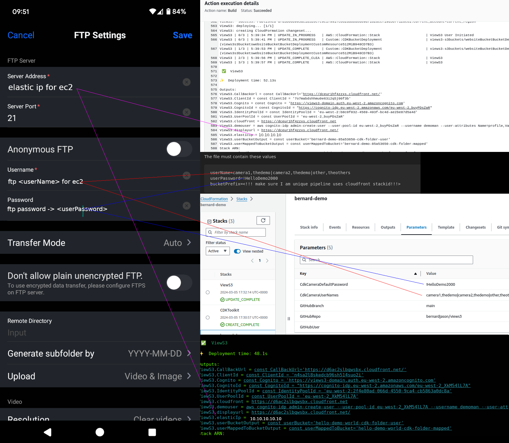

# ViewS3

This project allows multiple security cameras and groups of users to log onto a website to display the videos captured by their security cameras.

***deploying this project will incur costs on AWS, it is not free***

This is a home project, design decisions are to keep it cheap. If you try this project there will be charges on your AWS account. I found cost per day was approximately $0.50

  


The main CDK stack:
- creates a dedicated VPC    
- creates a single EC2 in the VPC that provides a location for cameras to ftp upload video/jpg to.     
- SSM, to patch the EC2.     
- uses Cognito for authentication of users 
- Cognito identity pool for provide temporary AWS credentials.   
- Cloudfront/S3 for a React website to view video/jpgs captured.     
- EC2 uses IPV4
- ASG min 1 , max 1


## deploy using pipeline
***You need to take a fork of the code as the pipeline will be triggered/source from your github repository***

rough youtube video deploying with pipeline 

[](https://youtu.be/occbs4_J2_4 )

From the aws console eu-west-2 as admin create a cloudformation stack using

[pipeline.yaml](pipeline.yaml)

The stack will set up a codestar connection to your forked github project.

By default the pipeline stack defaults as much as possible for a demo. You will need to supply

  GitHubRepo:  which will be the name of your github account

  GitHubUser: is your login for github
    
The other values CdkCameraUserNames  and CdkCameraDefaultPassword set up 2 groups of camera ftp users:
* thedemo and theothers, which has 2 ftp users camera1 and camera2 

* theothers, which has 1 camera ftp user other

The password for the ftp accounts is set to this one password of `!HelloDemo2000`

The ftp accounts could have different passwords, it is the shell script in the EC2 userdata that is not sophisticated enough to implement this as yet.

Once the pipeline.yml stack completes you will need to do

1) 
you will need to confirm the pending codestar connection to github which pipeline.yml stack creates


github will prompt


2) 
trigger(Release change) the codepipeline as it will have failed during deployment as codestar connection would have been in pending status.



the pipeline will take approximately 10 minutes to complete. When it does you need to configure a demo Cognito user pool user for the web application



you can run this aws cli command from Cloudshell console



then to try the application go to the cloudfront url shown in the pipeline output



## to deploy at command line

### prerequisites 
node --version
v20.9.0
npm --version
10.1.0


To deploy the system create a file in cdk directory called 

views3.properties

The file must contain these values
```
userName=camera1,thedemo|camera2,thedemo|other,theothers
userPassword=!HelloDemo2000
bucketPrefix=<!!! make sure I am unique pipeline uses cloudfront stackid!!!>
```

where userName is a list of camera ftp usernames and the group they are in. 

userPassword is the initial password for each of the ftp users created. You 
will need to log onto the EC2 instance using SSM Session Manager as SSH port 22 is not enabled.

bucketPrefix. This has to be a unique name as S3 buckets have this as a prefix. 

```
mkdir client/build
cd cdk
cdk bootstrap
npm install
npm run cdk-deploy
npm run parse-client
npm run cognito-css
```

We now have to redeploy the React website as we have the details of Cloudfront/Cognito 
```
cd ../client
npm install
npm run build
cd ../cdk
npm run cdk-deploy
```

CDK output gives the front end URL and ip address cameras should upload to


Front end users are not added by CDK, nor can users sign add themselves. They must be provisioned with a script that creates the users with an initial password.
They also get a profile set, this is used to map the user to a group. Cameras and users are in a group.

```
node createUser.js  demoman thedemo HelloBernard1
```

or the CDK does output command needed for aws cli
ViewS3.demouser = .....


```
aws cognito-idp admin-create-user --user-pool-id <pool id>--username demoman --user-attributes Name=profile,Value=thedemo  --temporary-password 'HelloBernard1'
```

## updating my reolink camera for use



